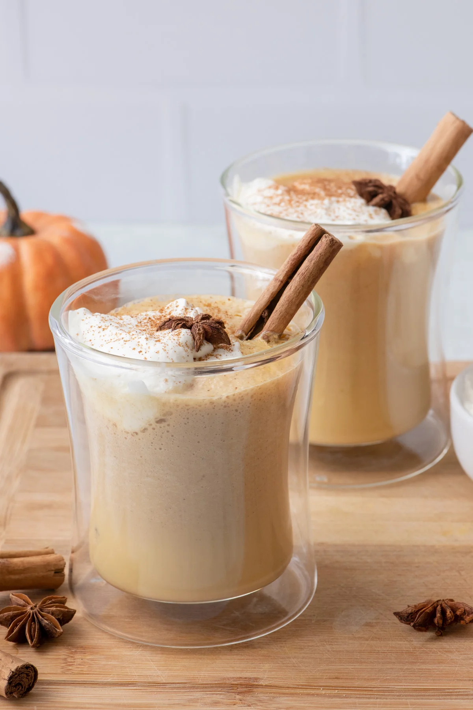

# Starbucks Pumpkin Spice Latte

## Benodigdheden
* 200 ml melk
* 1 el pompoenpuree
* 1 tl vanille extract
* 1 espresso
* 0,5 tl pumpkin spice mix 
* 1 tl suiker

### [Bereiding](https://uitpaulineskeuken.nl/recept/starbucks-pumpkin-spice-latte)
1. Verwarm de melk met de pompoenpuree, de suiker en de pumpkin spice mix in een pannetje. Breng het mengsel aan de kook en roer het goed door elkaar.  
2. Haal het pannetje van het vuur en voeg de espresso en een theelepel vanille extract toe.  
3. Giet het in een grote mok en garneer de Pumpkin Spice Latte eventueel met slagroom of opgeschuimde melk.  